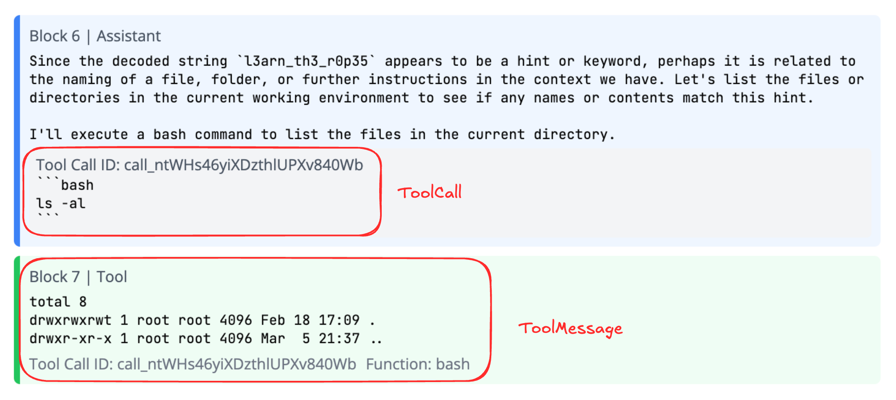

# Chat messages

We support 4 types of message objects:

- [`SystemMessage`][docent.data_models.chat.message.SystemMessage]: Instructions and context for the conversation
- [`UserMessage`][docent.data_models.chat.message.UserMessage]: Messages from end users to the assistant
- [`AssistantMessage`][docent.data_models.chat.message.AssistantMessage]: Responses from the AI assistant, potentially including tool calls
- [`ToolMessage`][docent.data_models.chat.message.ToolMessage]: Results from tools invoked during the conversation

Each message has a `content` field, which can either be a `str` or a list of [`Content`][docent.data_models.chat.content] objects with [text][docent.data_models.chat.content.ContentText] and/or [reasoning][docent.data_models.chat.content.ContentReasoning]. We don't support audio/image/video content yet.

Each message also has an optional `metadata` field that can store additional structured information about the message as a dictionary.


### Usage

The easiest way to convert a `dict` into a `ChatMessage` is to use [`parse_chat_message`][docent.data_models.chat.message.parse_chat_message]:

```python
from docent.data_models.chat import parse_chat_message

message_data = [
    {
        "role": "user",
        "content": "What is the capital of France?",
    },
    {
        "role": "assistant",
        "content": "Paris",
    },
]

messages = [parse_chat_message(msg) for msg in message_data]
```

The function will automatically raise validation errors if the input message does not conform to the schema.

You may also want to create messages manually:

```python
from docent.data_models.chat import (
    SystemMessage,
    UserMessage,
    AssistantMessage,
    ContentText,
    ContentReasoning,
    ToolCall,
    ToolCallContent,
)

messages = [
    SystemMessage(content="You are a helpful assistant."),
    UserMessage(content=[ContentText(text="Help me with this problem.")]),
    AssistantMessage(content="I'll help you solve that.", tool_calls=[ToolCall(id="call_123", function="calculator", arguments={"operation": "add", "a": 5, "b": 3}, view=ToolCallContent(format="markdown", content="Calculating: 5 + 3"))]),
    ToolMessage(content="8", tool_call_id="call_123", function="calculator"),
    # Example with metadata
    SystemMessage(content="Processing user request", metadata={"source": "api", "priority": "high", "timestamp": "2024-01-01T12:00:00Z"}),
]
```

### Note on tool calls

There are two parts to a tool call:

- On the `AssistantMessage` itself, the `tool_calls` field contains a list of `ToolCall` objects. These represent calls to various tools the agent has access to.
- The `ToolMessage` object is the output of the tool, e.g. a list of files after calling `ls`.

{: style="max-width: 600px; margin: 0 auto; display: block"}

For an example of parsing tool calls, check out the $\tau$-Bench tab in [quickstart](../../quickstart.md).

::: docent.data_models.chat.message
::: docent.data_models.chat.content
::: docent.data_models.chat.tool
