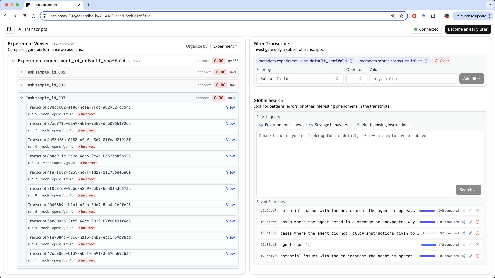

# Welcome to Docent

Docent provides tools to **summarize, cluster, and search** over agent transcripts. It automatically surfaces interesting observations, answers questions, and helps users form hypotheses about their agents.
<!-- It also provides infrastructure for **counterfactual experimentation** to test those hypotheses; users can modify and resume agents from past checkpoints. In the longer term, we anticipate that this experimental loop will be executed by AI systems themselves, with humans providing guidance. -->

In addition to analyzing agent transcripts, our users have also gotten value from using Docent for other applications such as:

- Observing anomalies in long reasoning traces
- Monitoring RL training rollouts to find unexpected or unwanted behaviors

<!-- ## Key features

🚜WIP🚜 -->

### Get started

Check out our tutorials to learn how to use Docent:

- Start by [installing Docent and ingesting agent runs](./quickstart.md)
- Then try running [search and clustering](./tutorials/search_and_clustering.md) over your data

### Learn more about Docent

Explore our technical writeups to learn how we've used Docent to analyze agent behavior:

- [Introducing Docent](https://transluce.org/introducing-docent): an introduction to Docent and how we used it to analyze several popular agent benchmarks
- [Investigating O3's Truthfulness](https://transluce.org/investigating-o3-truthfulness): an investigation into OpenAI o3's tendency to hallucinate fabricated actions
